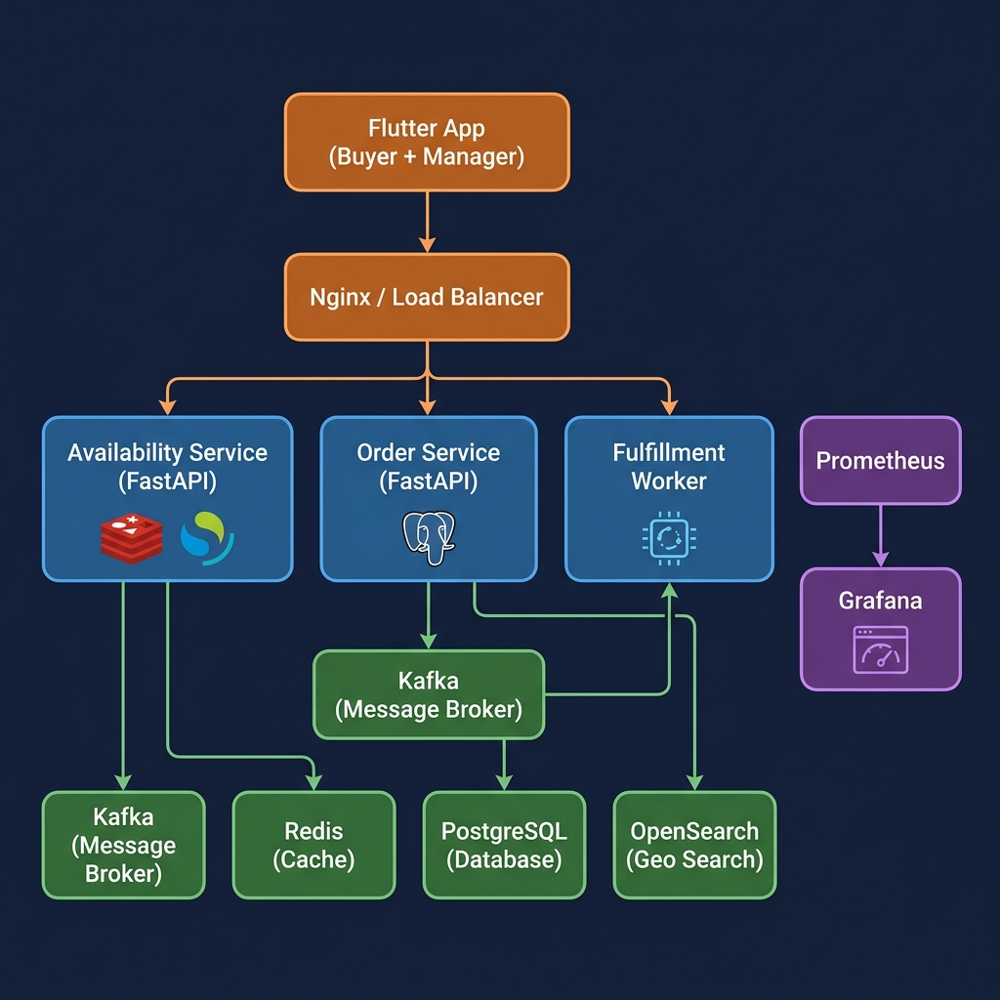

<p align="center">
  <h1 align="center">🚀 Rapid Delivery Service</h1>
  <p align="center">
    <strong>Multi-Warehouse Aggregated Delivery Platform</strong>
  </p>
  <p align="center">
    <a href="#architecture"></a>
    <a href="#tech-stack"></a>
    <a href="#tech-stack"></a>
    <a href="#tech-stack"></a>
    <a href="#monitoring"></a>
    <a href="#tech-stack"></a>
    <a href="#tech-stack"></a>
  </p>
</p>

---

## 📋 Overview

Rapid Delivery Service is a **production-grade multi-warehouse delivery platform** designed to solve the fragmented inventory problem faced by businesses with multiple store locations in cities like Jaipur, Mumbai, and Delhi.

**The Problem:** A customer orders 5 items, but the nearest store only has 3. The other 2 are available at a store 8km away — but the customer would never know.

**The Solution:** Aggregate inventory across all nearby warehouses (up to 30km), intelligently consolidate orders, and deliver everything in one trip when possible.

### Key Features

- 🏪 **Multi-Warehouse Aggregation** — Shows inventory from the 3 nearest warehouses, not just one
- 🛒 **Smart Cart Consolidation** — Minimizes delivery trips by grouping items to fewest warehouses
- ⚡ **Real-time Stock** — Redis-backed inventory with live updates
- 📊 **Grafana Dashboards** — 17-panel business + operations dashboard with demand prediction
- 🔍 **Geo-Spatial Search** — OpenSearch-powered nearest-warehouse discovery
- 📦 **Async Order Processing** — Kafka (local) / SQS (AWS) message-driven fulfillment
- 👥 **Dual Roles** — Buyer app + Warehouse Manager dashboard
- 🏗️ **Infrastructure as Code** — Terraform for both local Docker and full AWS deployment

---

## 🏗️ Architecture

<p align="center">
  
</p>

```
┌─────────────────────────────────────────────────────────────┐
│                    Flutter App (Dart)                        │
│              Buyer Home  │  Manager Dashboard                │
└──────────────┬───────────┴───────────┬──────────────────────┘
               │                       │
        ┌──────▼──────┐         ┌──────▼──────┐
        │ Availability │         │   Order     │
        │   Service    │         │   Service   │
        │  (FastAPI)   │         │  (FastAPI)  │
        └──┬───┬───┬──┘         └──┬─────┬────┘
           │   │   │               │     │
    ┌──────▼┐ ┌▼───▼──┐    ┌──────▼┐  ┌─▼────────┐
    │ Redis │ │OpenSrch│    │Postgre│  │Kafka/SQS │
    │(Stock)│ │ (Geo)  │    │ (ACID)│  │(Messages)│
    └───────┘ └───────┘    └───────┘  └─────┬────┘
                                            │
                                    ┌───────▼───────┐
                                    │  Fulfillment   │
                                    │    Worker      │
                                    │ (Background)   │
                                    └───────┬───────┘
                                            │
                                    ┌───────▼───────┐
                                    │  Prometheus +  │
                                    │    Grafana     │
                                    └───────────────┘
```

---

## 🛠️ Tech Stack

| Layer | Technology | Purpose |
|-------|-----------|---------|
| **Frontend** | Flutter (Dart) | Cross-platform mobile + web app |
| **API Gateway** | Nginx | CORS, load balancing, SSL termination |
| **Availability** | FastAPI + Redis + OpenSearch | Geo-search, stock lookups, inventory aggregation |
| **Orders** | FastAPI + PostgreSQL | ACID order storage, order splitting |
| **Fulfillment** | Python Worker + Kafka/SQS | Async order processing, stock deductions |
| **Cache** | Redis 7 | Real-time inventory state |
| **Search** | OpenSearch 2.11 | Geo-spatial warehouse discovery |
| **Database** | PostgreSQL 15 | Order history, transactional data |
| **Messaging** | Apache Kafka (local) / AWS SQS | Event-driven order pipeline |
| **Monitoring** | Prometheus + Grafana | Metrics, dashboards, demand prediction |
| **Infrastructure** | Terraform + Docker | IaC for local and AWS deployments |
| **CI/CD** | GitHub Actions | Automated Docker builds and deployments |

---

## 📊 Monitoring Dashboard

The platform includes a **17-panel Grafana dashboard** that auto-provisions on first startup:

### Business Overview
- 🛒 Total Orders Placed / Failed / Fulfilled
- 🏪 Multi-Warehouse Orders (orders spanning 2+ warehouses)

### Order Flow & Inventory
- 📦 Orders per warehouse (rate/min time series)
- 🥬 Top items ordered by quantity
- 📊 Inventory heatmap (stock levels across all warehouses)
- ⚠️ Low stock alerts (items below threshold)

### Performance & Demand
- ⏱️ Order processing time (p50/p95/p99 percentiles)
- 📉 Stock deduction burn rate by item
- 🔥 Fastest selling items (demand prediction signal)
- 📉 Items approaching stockout

### Infrastructure Health
- 🟢 Service health (up/down status)
- 💾 Redis memory usage
- 🔧 Database health

### Demand Prediction API
```
GET /metrics/demand
→ Returns: restock_needed, imbalanced_items, high_demand_items
→ Example: "Paneer will run out at Jaipur Central in ~6 hours"
```

---

## 🚀 Quick Start

### Prerequisites
- Docker Desktop
- Python 3.9+
- Flutter SDK (for frontend)

### Local Deployment

```bash
# 1. Clone the repository
git clone https://github.com/YOUR_USERNAME/Rapid_Delivery_Service.git
cd Rapid_Delivery_Service

# 2. Start all services (databases + microservices + monitoring)
cd local
docker-compose -f docker-compose-local.yaml up -d --build

# 3. Wait for services to be healthy (~90 seconds)
docker ps

# 4. Seed inventory data
cd ..
python local/seed_local.py

# 5. Open the dashboards
# Grafana:     http://localhost:3000  (admin / rapid123)
# Prometheus:  http://localhost:9090
# Kafka UI:    http://localhost:8085
# API Docs:    http://localhost:8000/docs
```

### Run Flutter App

```bash
cd rapid_delivery_app
flutter pub get
flutter run -d chrome   # Web
flutter run             # Mobile
```

---

## 🌐 Service Ports

| Service | Local Port | URL |
|---------|-----------|-----|
| Availability API | 8000 | http://localhost:8000/docs |
| Order API | 8001 | http://localhost:8001/docs |
| Fulfillment Metrics | 8002 | http://localhost:8002/metrics |
| Grafana | 3000 | http://localhost:3000 |
| Prometheus | 9090 | http://localhost:9090 |
| Kafka UI | 8085 | http://localhost:8085 |
| PostgreSQL | 5432 | — |
| Redis | 6379 | — |
| OpenSearch | 9200 | http://localhost:9200 |

---

## 📁 Project Structure

```
Rapid_Delivery_Service/
├── availability-service/        # FastAPI: geo-search, stock, inventory aggregation
│   ├── main.py                  # Endpoints + Prometheus metrics + demand API
│   ├── Dockerfile
│   └── requirements.txt
├── order-service/               # FastAPI: order placement + multi-warehouse splitting
│   ├── main.py                  # Order splitting, Prometheus counters
│   ├── Dockerfile
│   └── requirements.txt
├── fulfillment-worker/          # Background worker: processes orders from Kafka/SQS
│   ├── main.py                  # Stock deductions, processing metrics
│   ├── Dockerfile
│   └── requirements.txt
├── rapid_delivery_app/          # Flutter: buyer + manager mobile/web app
│   └── lib/
│       ├── screens/             # Buyer home, cart, manager inventory
│       ├── services/            # API service, auth service
│       └── widgets/             # Product cards with ETA badges
├── local/                       # Local Docker deployment
│   ├── docker-compose-local.yaml
│   ├── prometheus.yml
│   ├── seed_local.py
│   └── grafana/                 # Auto-provisioned dashboards
│       ├── dashboards/          # JSON dashboard definitions
│       └── provisioning/        # Datasource + dashboard providers
├── monitoring/                  # AWS/Production monitoring config
│   └── prometheus-aws.yml
├── terraform-local/             # Terraform: local Docker infra on EC2
├── terraform-files/             # Terraform: full AWS deployment
├── .github/workflows/           # GitHub Actions CI/CD
├── docker-compose.yaml          # Production compose with monitoring
├── seed.py                      # AWS data seeding
└── seed_warehouses.py           # Warehouse geo-data seeding
```

---

## 🔧 Configuration

All services are configured via environment variables — **no hardcoded values**:

| Variable | Service | Default | Description |
|----------|---------|---------|-------------|
| `OPENSEARCH_URL` | availability | `http://localhost:9200` | OpenSearch endpoint |
| `REDIS_HOST` | all | `localhost` | Redis host |
| `MAX_DELIVERY_DISTANCE_KM` | availability | `30.0` | Max delivery radius |
| `LOW_STOCK_THRESHOLD` | availability | `20` | Alert threshold |
| `DB_HOST` | order, fulfillment | `postgres` | PostgreSQL host |
| `KAFKA_BOOTSTRAP_SERVERS` | order, fulfillment | `localhost:9092` | Kafka brokers |
| `NO_KAFKA` | order, fulfillment | `false` | Skip Kafka (DB-only mode) |
| `ENV` | all | `prod` | `local` or `prod` |
| `SQS_QUEUE_URL` | order, fulfillment | — | AWS SQS (production only) |
| `GRAFANA_PASSWORD` | grafana | `rapid123` | Dashboard login password |

---

## 📈 Multi-Warehouse Order Flow

```
Customer places order with items from 2 warehouses:
  [Banana × 2 (wh_lnmiit), Paneer × 1 (wh_malviya)]
                    │
                    ▼
            ┌───────────────┐
            │ Order Service │  Groups items by warehouse_id
            └───────┬───────┘
                    │
         ┌──────────┴──────────┐
         ▼                     ▼
  Sub-Order A              Sub-Order B
  wh_lnmiit                wh_malviya
  [Banana × 2]             [Paneer × 1]
         │                     │
         ▼                     ▼
  ┌──────────────┐     ┌──────────────┐
  │ Kafka/SQS    │     │ Kafka/SQS    │
  │ order_events │     │ order_events │
  └──────┬───────┘     └──────┬───────┘
         │                     │
         └──────────┬──────────┘
                    ▼
            ┌───────────────┐
            │  Fulfillment  │  Processes each sub-order independently
            │    Worker     │  Deducts stock from correct warehouse
            └───────────────┘
```

---

## 🔮 Demand Prediction

The platform includes a demand analysis endpoint that powers the warehouse manager dashboard:

```json
GET /metrics/demand

{
  "restock_needed": [
    {
      "item_id": "paneer",
      "warehouse_id": "wh_jaipur_central",
      "current_stock": 3,
      "suggested_restock": 85,
      "priority": "critical"
    }
  ],
  "high_demand_items": [
    {
      "item_id": "coffee",
      "total_stock": 45,
      "recommendation": "Increase supply — demand exceeding stock"
    }
  ],
  "imbalanced_items": [
    {
      "item_id": "chips",
      "min_stock": 5,
      "max_stock": 200,
      "recommendation": "Redistribute stock across warehouses"
    }
  ]
}
```

---

## 🧪 Testing

```bash
# Test availability (nearest warehouse with stock)
curl "http://localhost:8000/availability?item_id=apple&lat=26.9124&lon=75.7873"

# Test aggregated availability (multi-warehouse)
curl "http://localhost:8000/availability/aggregated?lat=26.9124&lon=75.7873"

# Place an order
curl -X POST http://localhost:8001/orders \
  -H "Content-Type: application/json" \
  -d '{"customer_id":"test","items":[{"item_id":"apple","warehouse_id":"wh_jaipur_central","quantity":2}]}'

# Check demand insights
curl http://localhost:8000/metrics/demand

# Check Prometheus metrics
curl http://localhost:8000/metrics
curl http://localhost:8001/metrics
curl http://localhost:8002/metrics
```

---

## ☁️ AWS Deployment

The project includes Terraform configurations for full AWS deployment:

```bash
# Deploy infrastructure
cd terraform-files
terraform init
terraform plan
terraform apply

# Seed production data
python seed_aws.py
```

**AWS Services Used:**
- EC2 / ECS — Container hosting
- RDS PostgreSQL — Order database
- ElastiCache Redis — Inventory cache
- OpenSearch Service — Geo-spatial search
- SQS — Order message queue
- SNS — Notifications
- S3 — Terraform state

---

## 📄 License

This project is licensed under the MIT License — see the [LICENSE](LICENSE) file for details.

---

<p align="center">
  Built with ❤️ for solving real-world delivery problems
</p>
